<div align="center">

# Habit Forge

**Build habits. Track streaks. Actually stick to it.**

A command-line habit tracker built for **IU Germany** — object-oriented design meets functional analytics in plain Python.

[](https://www.python.org/)
[](https://www.sqlite.org/)
[](https://click.palletsprojects.com/)
[](https://pytest.org/)
[]()
[](https://www.iu.org/)

[](https://github.com/SudhanshuBiswas01/habit-forge-iu-germany)
[]()
[]()
[]()

[Features](#-features) · [Demo](#-demo-screenshots) · [HLD](#-high-level-design-hld) · [Install](#-installation) · [Usage](#-usage) · [Tests](#-testing) · [Structure](#-project-structure) · [Author](#-author)

</div>

---

## About

**Habit Forge** is a terminal-based habit tracker where you create daily or weekly habits, log completions, and watch your streaks grow (or crumble). No web server, no ORM — just Python, SQLite, and a Click-powered menu.

Built as a **5th semester elective** (2025/26) at IU Germany: *Object Oriented and Functional Programming with Python*.

**Dependencies:** `click`, `pytest` — SQLite is in the Python standard library.


---

## Features

| Feature | Description |
|---------|-------------|
| **Daily & weekly habits** | Two periodicities, different streak rules per type |
| **Streak engine** | Consecutive calendar days (daily) or Mon–Sun weeks (weekly) |
| **Broken detection** | See at a glance if you missed the current period |
| **Functional analytics** | `filter`, `map`, `reduce` — no classes in `analytics.py` |
| **Sample data** | 5 preloaded habits + ~4 weeks of realistic history on first run |
| **SQLite persistence** | Lightweight `habits.db`, created automatically |

---

## Tech stack

`Python` · `SQLite3` · `Click` · `pytest` · `datetime` · `functools`

---

## Demo (screenshots)

Step-by-step walkthrough of the CLI and tests.

### Step 1 — Run the CLI (`python cli.py`)

Main menu on first launch (sample habits load automatically):

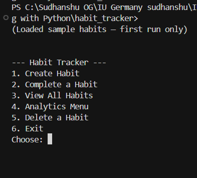

---

### Step 2 — Create a habit

Choose **1**, enter name, description, and periodicity. The habit is saved to SQLite:

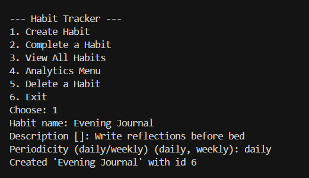

---

### Step 3 — View all habits

Choose **3** to see every habit with **streak** and **on track / broken** status:

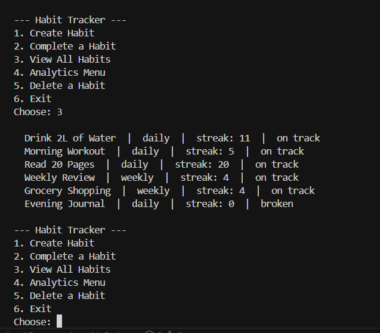

---

### Step 4 — Analytics menu

Choose **4** from the main menu.

**4a — Longest streak (all habits)** — option `c`:

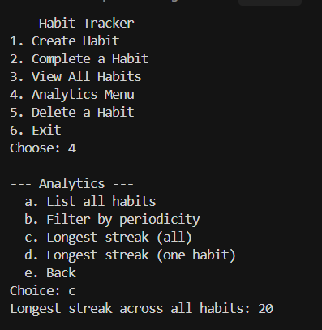

**4b — Filter by periodicity** — option `b`, then `daily`:

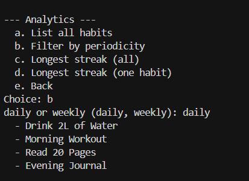

---

### Step 5 — Run tests (`pytest -v`)

All unit tests pass (in-memory DB — your `habits.db` is not used):

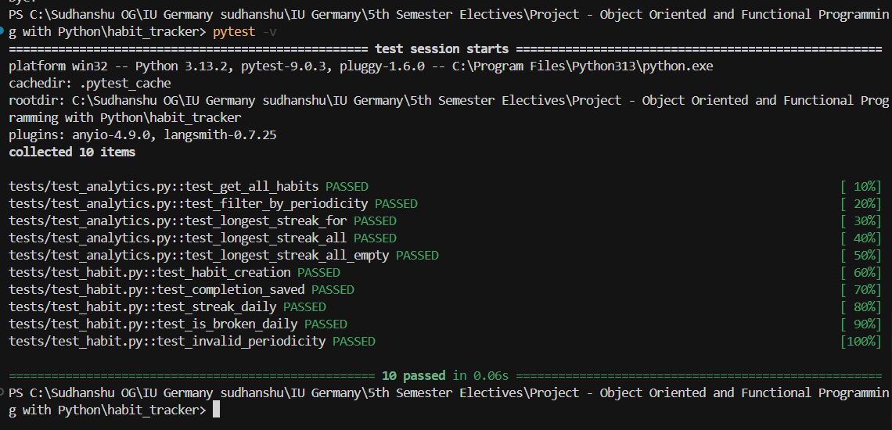

---

## High-Level Design (HLD)

Architecture overview — layers, classes, database, and main flows (Mermaid).

### System context

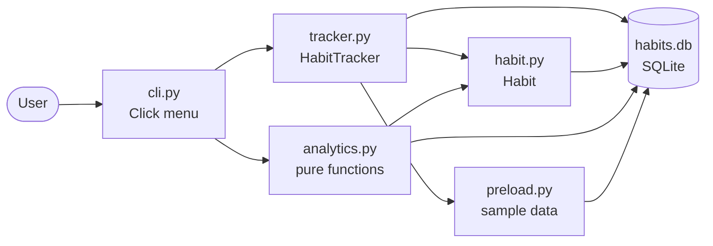

Single-user CLI. No network. Analytics uses `filter` / `map` / `reduce` — no classes in `analytics.py`.

### Layered architecture

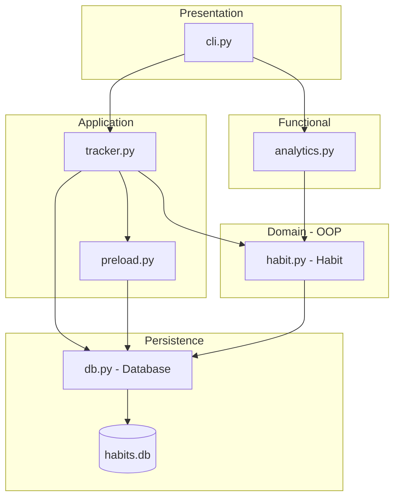

| Layer | Module | Responsibility |
|-------|--------|----------------|
| Presentation | `cli.py` | Menus, user input, output |
| Application | `tracker.py` | Create / delete / complete habits |
| Application | `preload.py` | Seed sample data (empty DB only) |
| Domain | `habit.py` | Habit entity, streak & broken logic |
| Functional | `analytics.py` | Filter / map / reduce over habits |
| Persistence | `db.py` | SQLite CRUD |

### Class diagram (OOP)

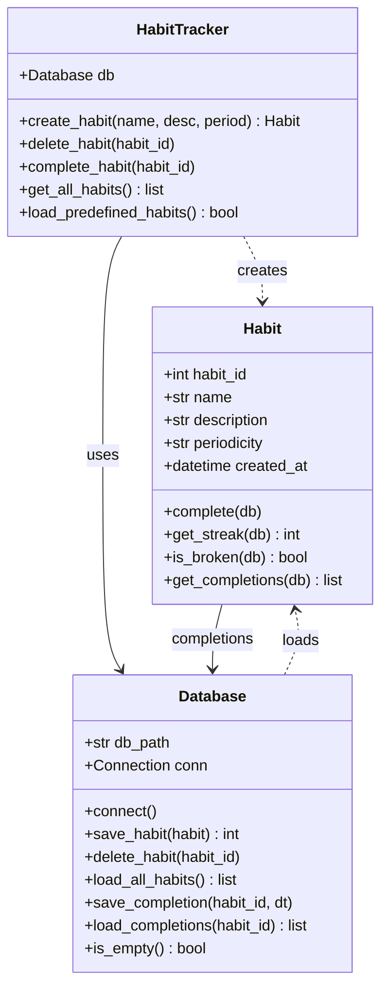

### Database schema

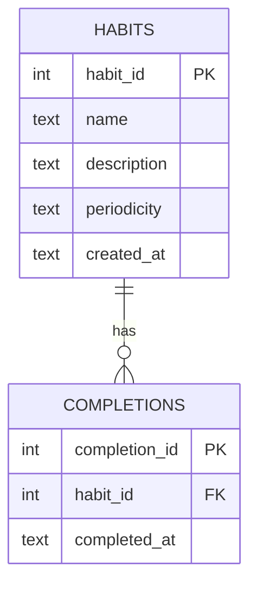

Datetimes stored as **ISO 8601** text in SQLite.

### Flow — complete a habit

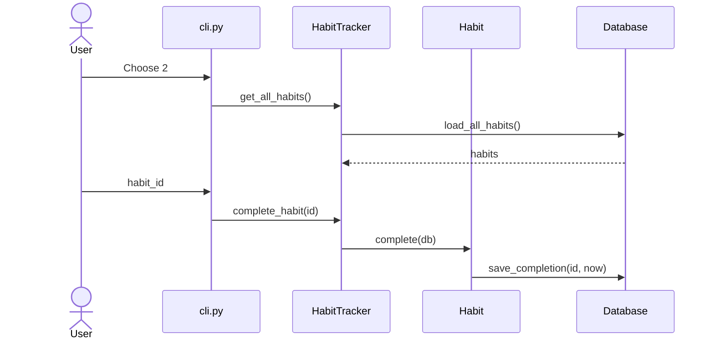

### Flow — analytics (longest streak)

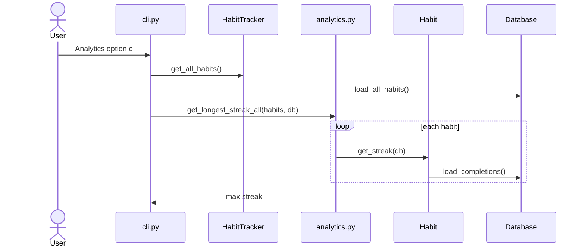

### Streak logic

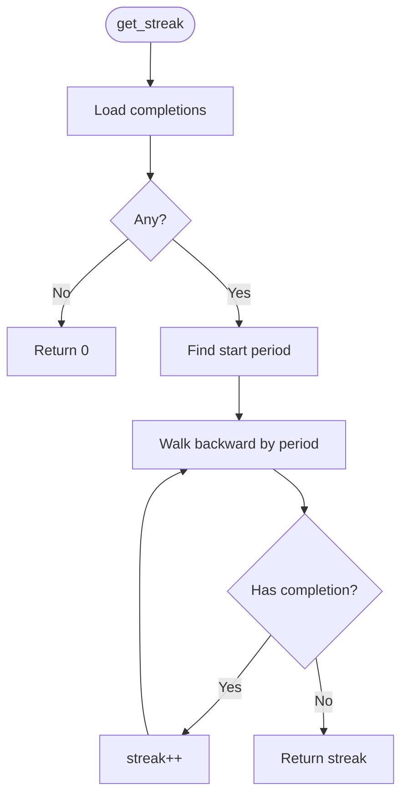

| Periodicity | One period |
|-------------|------------|
| `daily` | Calendar day |
| `weekly` | Monday – Sunday |

### Design decisions

| Decision | Why |
|----------|-----|
| SQLite + raw SQL | Simple, no ORM |
| `Habit` owns streak logic | Domain stays on the entity |
| Separate `analytics.py` | OOP vs functional split for the course |
| `preload.py` isolated | Easy reset / demo data |
| Click CLI | Clean menus, less boilerplate |

---

## Installation

**Requirements:** Python 3.7+, pip

```bash
git clone https://github.com/SudhanshuBiswas01/habit-forge-iu-germany.git
cd habit-forge-iu-germany
pip install -r requirements.txt
python cli.py
```

> **Quick start:** clone → install → run `python cli.py`. Sample habits load automatically on first launch.

---

## Usage

Start the interactive CLI from the project root:

```bash
python cli.py
```

### Main menu

```
--- Habit Tracker ---
1. Create Habit
2. Complete a Habit
3. View All Habits
4. Analytics Menu
5. Delete a Habit
6. Exit
```

**Analytics submenu** — list all habits, filter by periodicity, longest streak (all habits or pick one).

Example habit line when viewing all:

```
Morning Workout  |  daily  |  streak: 12  |  on track
```

### First run

If the database is empty, the app seeds **5 sample habits** with about **4 weeks** of completion history:

| Habit | Period |
|-------|--------|
| Drink 2L of Water | daily |
| Morning Workout | daily |
| Read 20 Pages | daily |
| Weekly Review | weekly |
| Grocery Shopping | weekly |

### Reset / reseed

```bash
# delete the db, then run again
rm habits.db        # macOS / Linux
del habits.db       # Windows

python cli.py
```

Preload only runs when there are **zero** habits in the database.

---

## Testing

```bash
pytest -v
```

Tests use an **in-memory SQLite** database — your real `habits.db` is never touched.

```
tests/
├── test_habit.py       # model, completions, streaks, is_broken
└── test_analytics.py   # filter / map / reduce helpers
```

---

## Project structure

```
habit-forge-iu-germany/    # repo root (after git clone)
├── habit.py          # Habit class — streaks, completions, broken check
├── db.py             # Database — SQLite CRUD
├── tracker.py        # HabitTracker — create, complete, delete, preload
├── analytics.py      # Pure functions only (functional programming)
├── cli.py            # Click CLI — entry point
├── preload.py        # Seeds 5 habits + dummy history
├── tests/
│   ├── conftest.py
│   ├── test_habit.py
│   └── test_analytics.py
├── screenshots/      # CLI & pytest demo images
├── habits.db         # generated at runtime (gitignored)
├── requirements.txt
└── README.md
```

### How streaks work

- **Daily** — each calendar day is one period; need ≥1 completion that day.
- **Weekly** — each Monday–Sunday week is one period.
- **Streak** — count of consecutive periods (going backward) with at least one completion.
- **Current period empty?** — streak is calculated from the last completed period, not from today.

---

## Tags

Topics for this repo (GitHub **Settings → Topics**):

```
python habit-tracker cli sqlite click pytest
object-oriented-programming functional-programming
iu-germany portfolio-project terminal-app streak-tracker
```

---

## Author

**Sudhanshu Biswas** · [GitHub](https://github.com/SudhanshuBiswas01)  
IU International University of Applied Sciences — OOP & Functional Programming (Python)

[](https://github.com/SudhanshuBiswas01)

---

<div align="center">

*Small habits compound. This app just counts them.*

</div>
