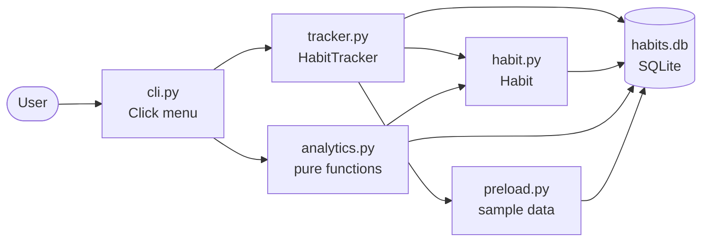
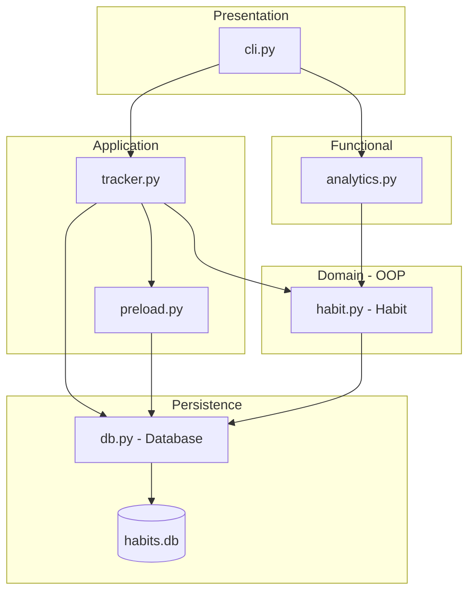
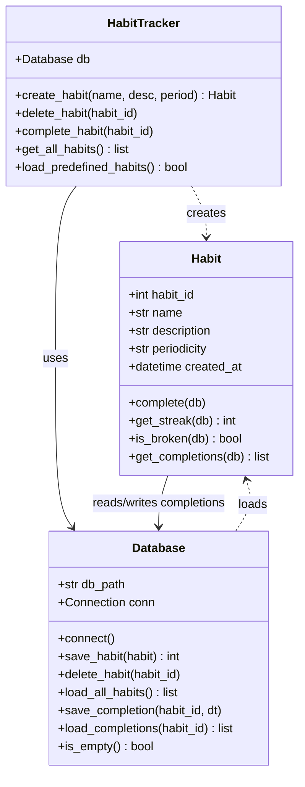
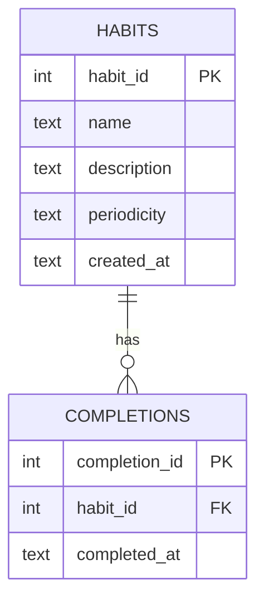
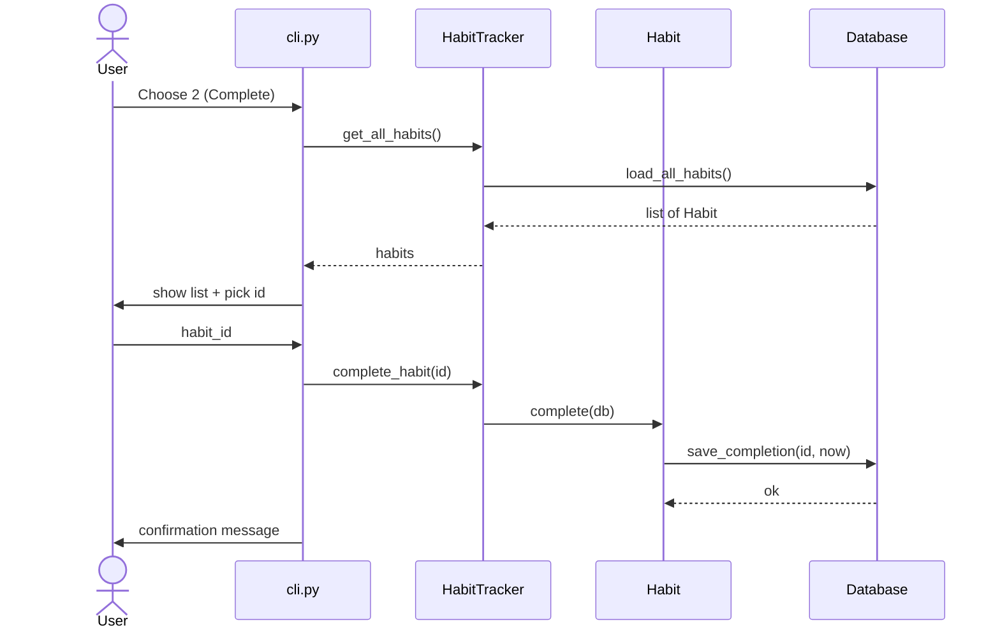
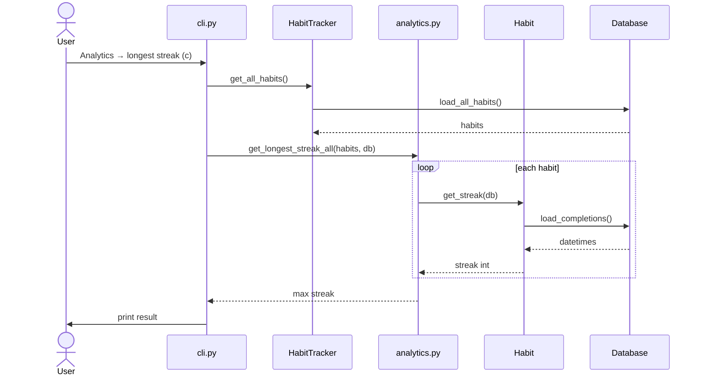
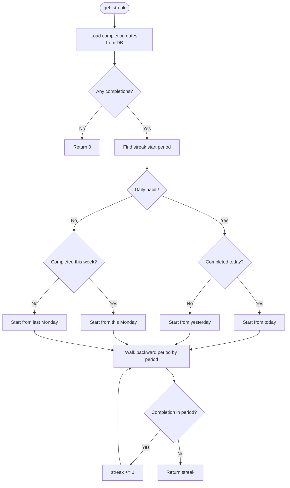
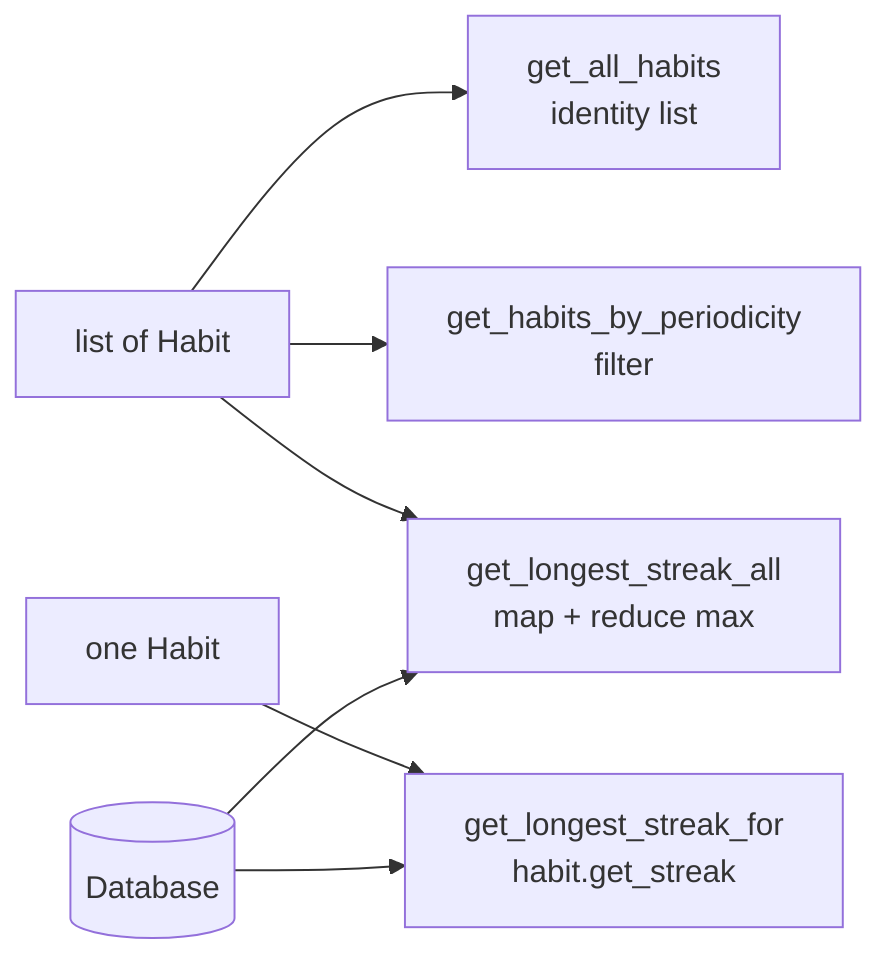
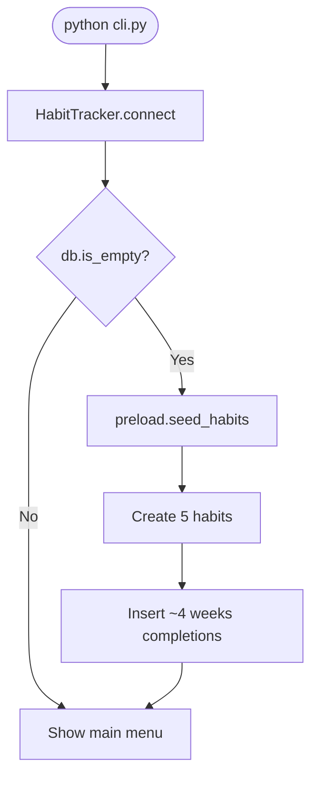
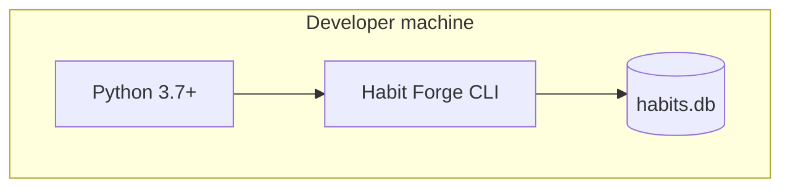

# High-Level Design (HLD) — Habit Forge

Overview of how the habit tracker is structured: layers, classes, data, and main flows.

---

## 1. System context

**Summary:** Single-user CLI app. No network layer. SQLite file on disk. Analytics reads habit objects and calls `get_streak()` — no shared global state in `analytics.py`.

---

## 2. Layered architecture

| Layer | Module | Responsibility |
|-------|--------|----------------|
| Presentation | `cli.py` | Menus, user input, output |
| Application | `tracker.py` | Create / delete / complete habits, orchestration |
| Application | `preload.py` | Seed 5 habits + 4 weeks of completions (empty DB only) |
| Domain | `habit.py` | Habit entity, streak & broken logic |
| Functional | `analytics.py` | Filter / map / reduce over habit lists |
| Persistence | `db.py` | SQL CRUD, ISO datetime storage |

---

## 3. Class diagram (OOP)

`analytics.py` has **no classes** — only functions that accept `habits` list + `db`.

---

## 4. Database schema

Datetimes stored as **ISO 8601** strings in SQLite.

---

## 5. Sequence — complete a habit

---

## 6. Sequence — view streaks (analytics)

---

## 7. Streak calculation (domain logic)

**Period rules**

| Periodicity | One period = |
|-------------|----------------|
| `daily` | One calendar day |
| `weekly` | Monday → Sunday |

---

## 8. Functional analytics (no classes)

Built-ins used: `filter`, `map`, `functools.reduce`, `max`.

---

## 9. First-run bootstrap

---

## 10. Deployment view

No server, containers, or cloud — local CLI only.

---

## Design decisions

| Decision | Why |
|----------|-----|
| SQLite + raw SQL | Simple, no ORM, fits course scope |
| `Habit` owns streak logic | Domain behaviour stays on the entity |
| Separate `analytics.py` | Clear split: OOP domain vs functional reporting |
| `preload.py` isolated | Demo data optional, easy to reset |
| Click for CLI | Readable menus without boilerplate |

---

[← Back to README](../README.md)
